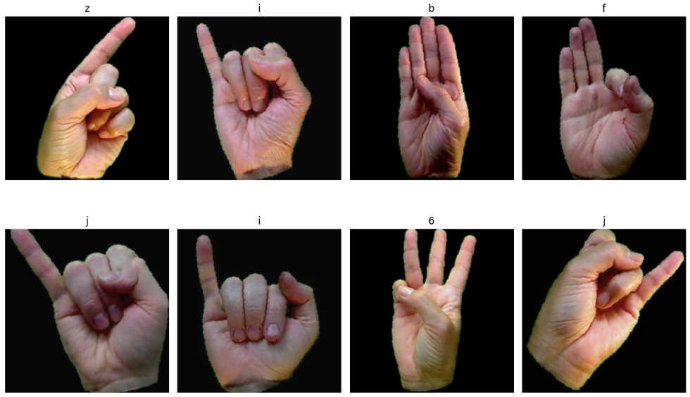
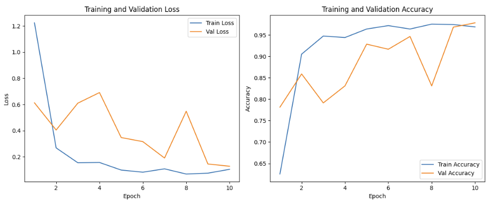
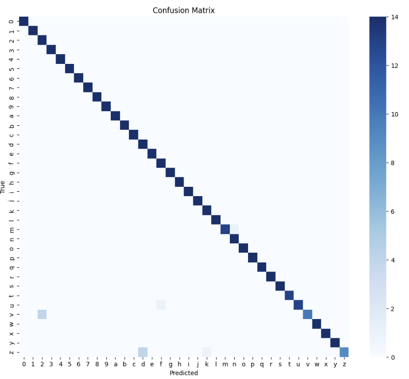
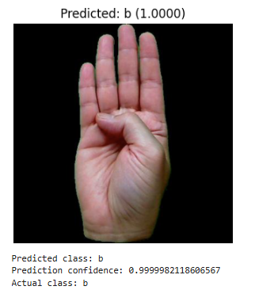

# American Sign Language (ASL) Classification

This project to be as part of UST Vision AI SEIS766 and collab with other part of teammate. 

## Setup
- Have Docker service available then build/run docker image. Can use instruction.txt as a guideline.
- If wish not to use Docker, Make sure to have all packages listed on requirements.txt and Dockerfile.

## Dataset
- Dataset used can be found on: https://www.kaggle.com/datasets/ayuraj/asl-dataset?select=asl_dataset (last access 3/29/2026).
- This notebook download dataset via Kagglehub. more infos on https://github.com/Kaggle/kagglehub/blob/main/README.md#download-dataset.
- make sure to check data as there can be multiple copy of same data (image) exist in subfolder. Cleaning up or chosing a right path is necessary.

## Achitecture
- Transfer Learning: RESNET18 and mobilenet_v3_small.
- will add more detail later on.

## Results

## Example Outputs

## Future Work
- convert notebooks to scripts
- Add Description generator model
- Add more robust classification (live image)